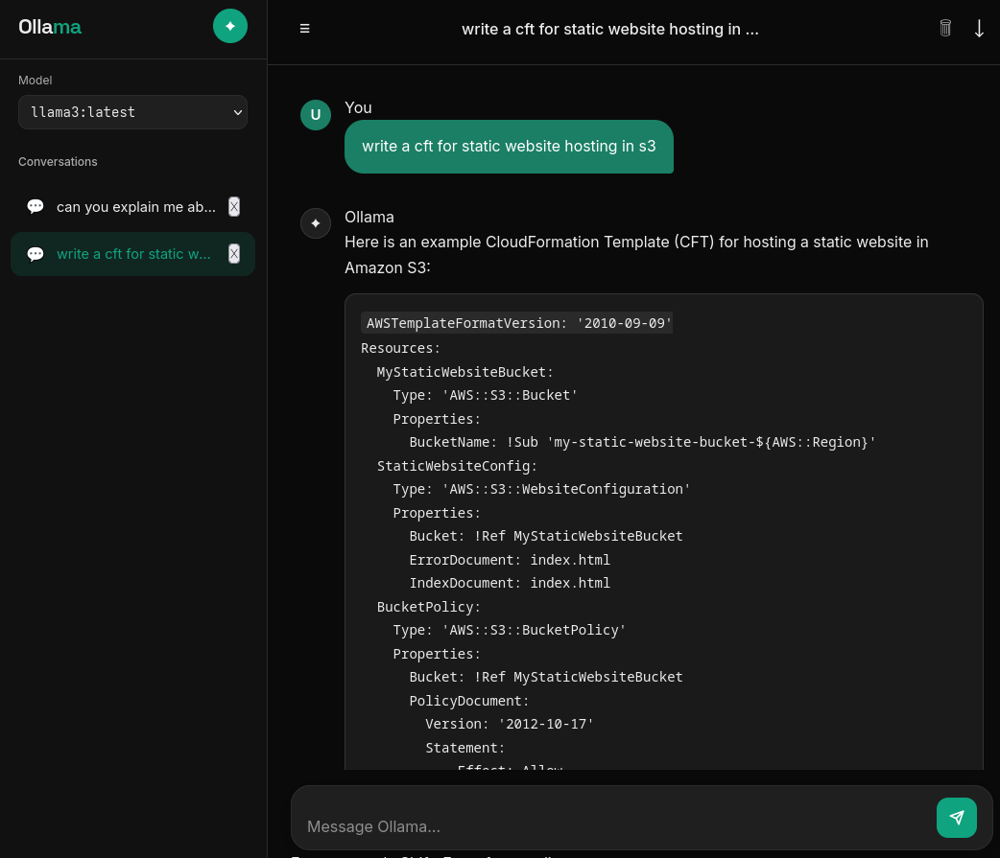

# Ollama Chat App

This is a simple web-based chat application built using FastAPI and Ollama. It allows users to interact with locally running AI models through a web interface.

## Demo 



## Project Structure

```
OllamaChat/
├── docker-compose.yaml
├── Dockerfile
├── LICENSE
├── manifest
│   ├── chat-app
│   │   ├── chat-deployment.yaml
│   │   ├── chat-ingress.yaml
│   │   └── chat-service.yaml
│   ├── ollama-model
│   │   ├── ollama-config.yaml
│   │   ├── ollama-deployment.yaml
│   │   ├── ollama-pvc.yaml
│   │   └── ollama-service.yaml
│   └── deploy-with-kubernetes.md
├── README.md
├── deploy-with-docker.md
└── src
    ├── main.py
    ├── requirements.txt
    ├── static
    └── templates
        └── index.html

```

## Features

- Web-based chat interface
- Integration with local Ollama models
- FastAPI backend and Simple frontend using HTML templates
- Docker support for easy deployment

## Setup and Run

1. [With Docker Compose](./deploy-with-docker.md)
2. [With Kubernetes](./manifest/deploy-with-kubernetes.md)


## License

This project is licensed under the MIT License.

---
