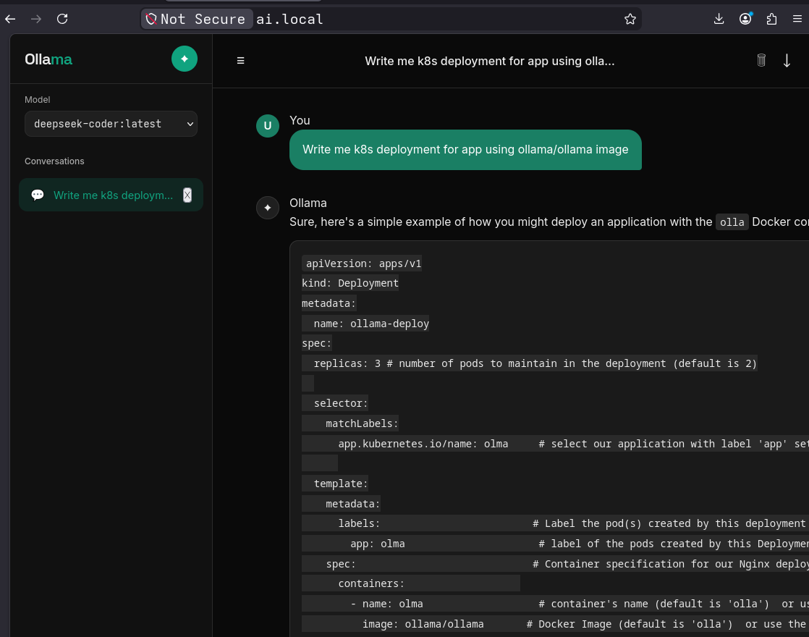
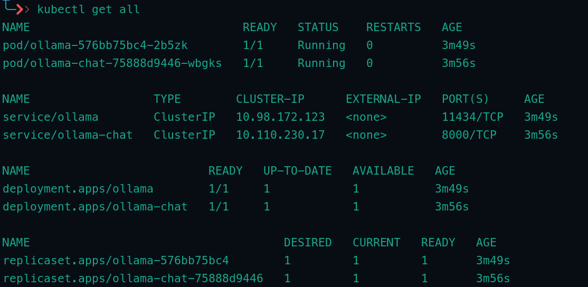

# Deploy With Kubernetes

There are manifests for deploying a chat application and an Ollama model service. It is structured into two main components:

* Chat Application (frontend/backend service)
* Ollama Model Service (LLM inference backend)

## Demo


---

## Manifest

```
manifest/
├── chat-app/
│   ├── chat-deployment.yaml
│   ├── chat-ingress.yaml
│   └── chat-service.yaml
├── ollama-model/
│   ├── ollama-config.yaml
│   ├── ollama-deployment.yaml
│   ├── ollama-pvc.yaml
│   └── ollama-service.yaml
└── resources
    ├── limitrange.yaml
    └── resourcequotas.yaml
```

---

## Prerequisites

Before deploying, ensure you have:

* Kubernetes cluster (Minikube, Kind, or cloud cluster)
* `kubectl` configured
* Ingress controller installed (e.g., NGINX Ingress)
* StorageClass available for PersistentVolumeClaims (if using Ollama model storage)

---

## Deployment Order

**Optionally: Deploy limitRange and resourceQuotas**
```bash
kubectl apply -f resources/
```

You must deploy in the following order:

1. Ollama Model Backend
2. Chat Application
3. Ingress Rules

---

# 1. Deploy Ollama Model Service

This section sets up the LLM backend with persistent storage.

### Apply Persistent Volume Claim

```bash
kubectl apply -f manifest/ollama-model/ollama-pvc.yaml
```

### Apply ConfigMap (if required)

```bash
kubectl apply -f manifest/ollama-model/ollama-config.yaml
```

ConfigMap is used to configure a model.
Models you can pull: 
* llama3: General
* llama3.1: Improved
* llama3.2: Refined
* mistral: Fast
* mixtral: Reasoning
* phi3: Lightweight
* gemma: Balanced
* gemma2: Stable
* codellama: Coding
* deepseek-coder: Programming
* deepseek-r1: Logic
* qwen: Multilingual
* qwen2: Advanced
* qwen2.5-coder: Developer
* llava: Vision

### Deploy Ollama Service

```bash
kubectl apply -f manifest/ollama-model/ollama-deployment.yaml
```

### Expose Ollama Service

```bash
kubectl apply -f manifest/ollama-model/ollama-service.yaml
```

### Verify

```bash
kubectl get pods
kubectl get svc
```

---

# 2. Deploy Chat Application

This deploys the frontend/backend chat service that communicates with Ollama.

### Deploy Chat Service

```bash
kubectl apply -f manifest/chat-app/chat-service.yaml
```

### Deploy Chat Application

```bash
kubectl apply -f manifest/chat-app/chat-deployment.yaml
```

---

# 3. Configure Ingress

This exposes the chat application to external network access.

### Apply Ingress Rules

```bash
kubectl apply -f manifest/chat-app/chat-ingress.yaml
```

### Verify Ingress

```bash
kubectl get ingress
```

### Verify Kubernetes Objects
```bash
kubectl get all
```



If using Minikube:

```bash
minikube ip
```

Add host mapping (if required):

```
<MINIKUBE_IP>  ai.local
```

---

## Access Application

After deployment:

* Chat App: via Ingress host (e.g. `http://your-domain.local`)
* Ollama Service: internal cluster service (used by chat backend)

---

## Troubleshooting

### Check pod status

```bash
kubectl get pods -o wide
```

### View logs

```bash
kubectl logs <pod-name>
```

### Describe resources

```bash
kubectl describe pod <pod-name>
```

---

## Notes

* Ensure Ollama model pull logic is correctly configured in the deployment or init container.
* PVC must be bound before Ollama pod starts successfully.
* Ingress controller must be running for external access.

---
